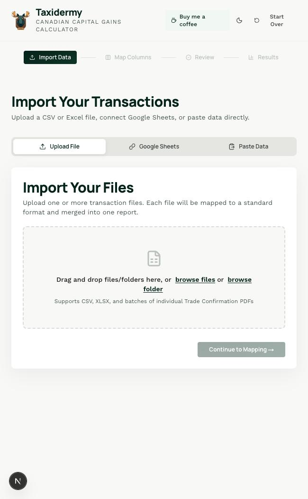
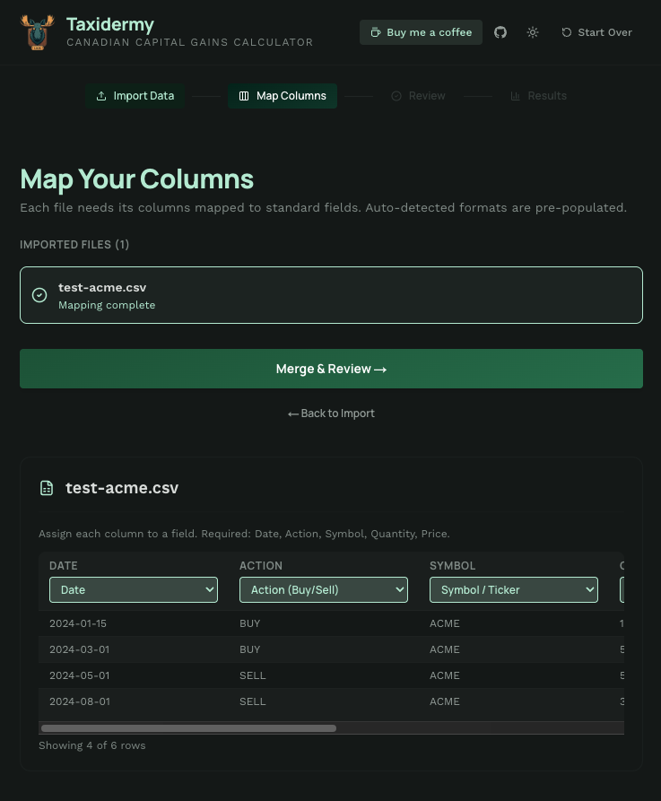
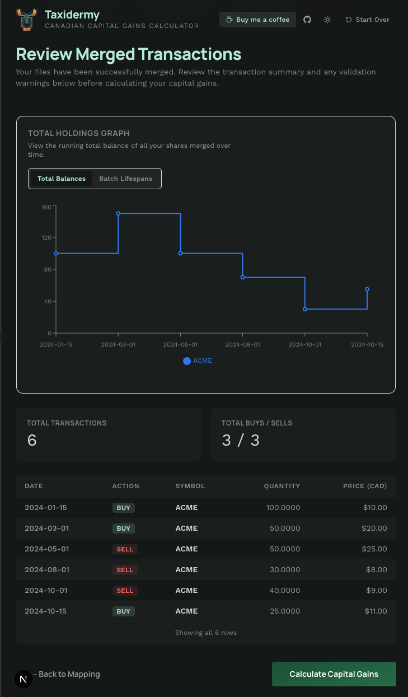
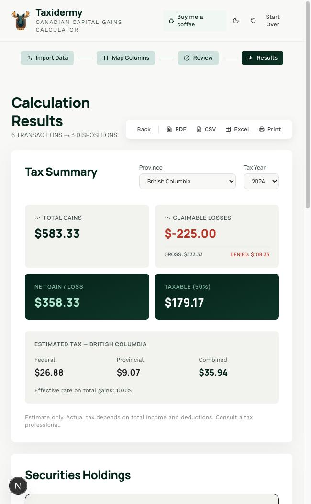
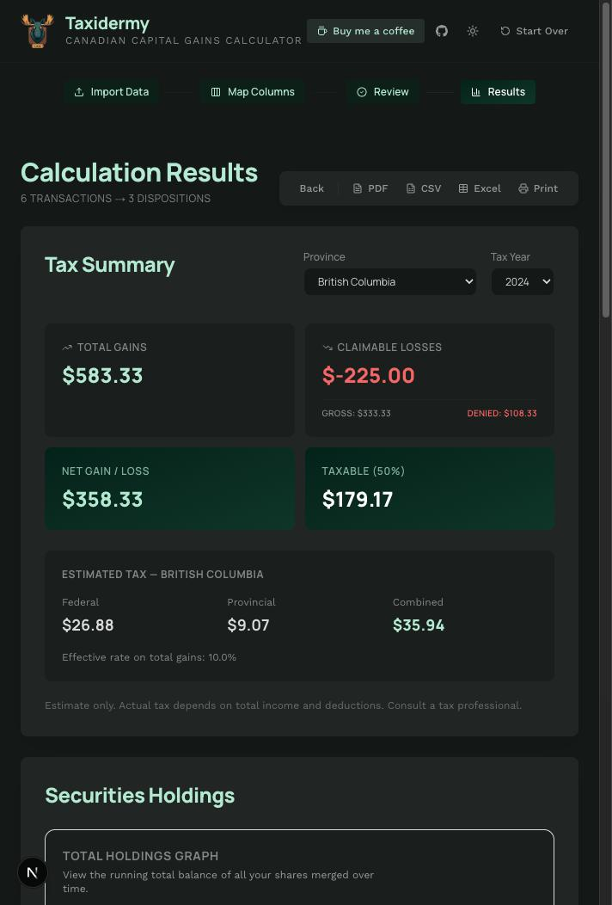
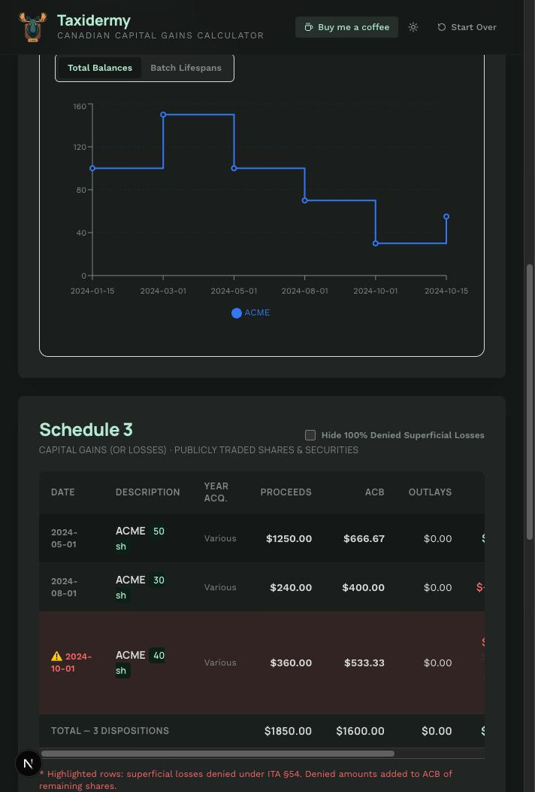
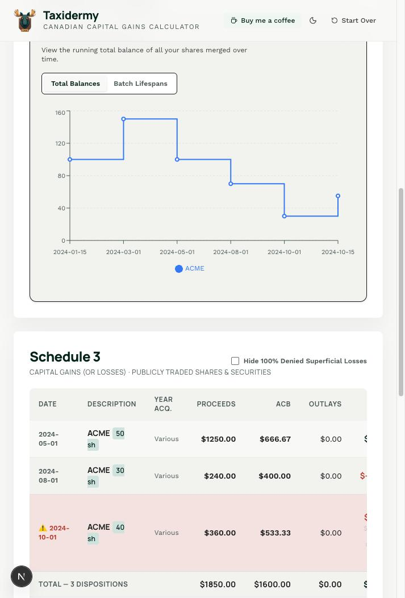
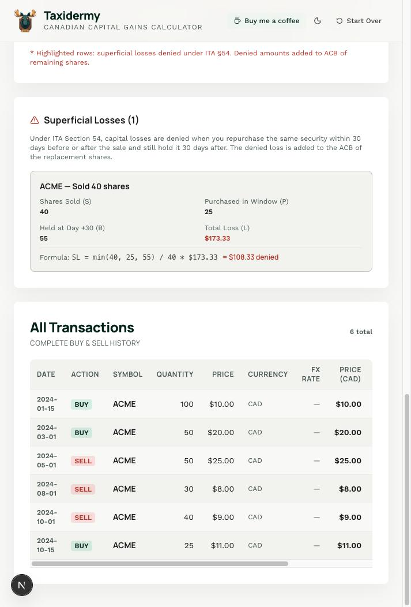
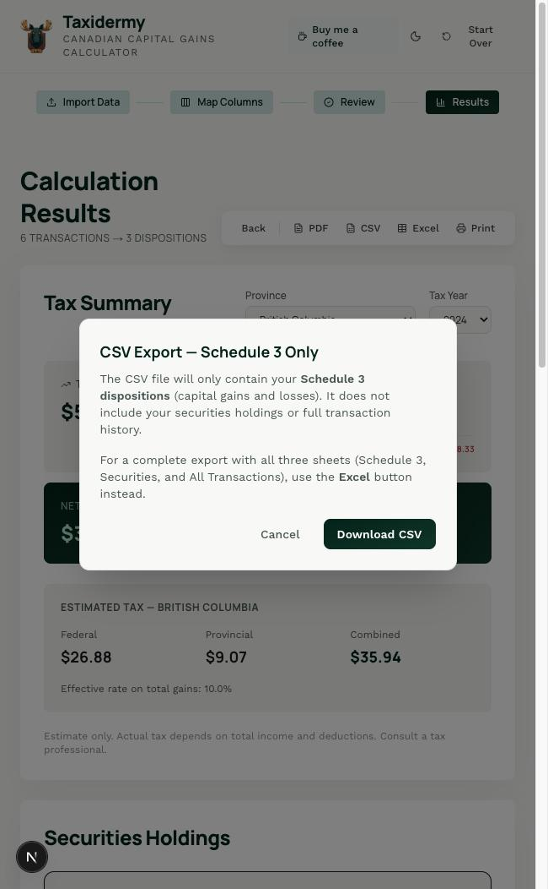

<p align="center">
  
</p>

<h1 align="center">Taxidermy</h1>
<p align="center"><strong>Canadian Capital Gains Calculator</strong></p>
<p align="center">
  A free, open-source, privacy-first tool for calculating Canadian capital gains taxes.<br/>
  Everything runs in your browser — no data ever leaves your machine.
</p>

<p align="center">
  <a href="https://kvadratni.github.io/taxidermy/"><strong>Live Demo</strong></a> &nbsp;|&nbsp;
  <a href="https://ko-fi.com/maxnovich">Buy me a coffee</a>
</p>

---

## Screenshots

<table>
  <tr>
    <td><strong>Import Data</strong></td>
    <td><strong>Map Columns</strong></td>
  </tr>
  <tr>
    <td></td>
    <td></td>
  </tr>
  <tr>
    <td><strong>Review Transactions</strong></td>
    <td><strong>Tax Summary (Light)</strong></td>
  </tr>
  <tr>
    <td></td>
    <td></td>
  </tr>
  <tr>
    <td><strong>Tax Summary (Dark)</strong></td>
    <td><strong>Schedule 3 (Dark)</strong></td>
  </tr>
  <tr>
    <td></td>
    <td></td>
  </tr>
  <tr>
    <td><strong>Schedule 3 (Light)</strong></td>
    <td><strong>Superficial Loss Details</strong></td>
  </tr>
  <tr>
    <td></td>
    <td></td>
  </tr>
  <tr>
    <td><strong>CSV Export Dialog</strong></td>
    <td></td>
  </tr>
  <tr>
    <td></td>
    <td></td>
  </tr>
</table>

---

## What is Taxidermy?

Filing Canadian capital gains taxes is painful — especially if you have E\*TRADE/Morgan Stanley brokerage statements, RSU vests, ESPP purchases, and hundreds of trade confirmations in PDF form.

**Taxidermy** automates the entire process:

1. **Import** your transactions from CSVs, Excel files, or bulk-upload trade confirmation PDFs
2. **Map** columns automatically (supports Questrade, Wealthsimple, Interactive Brokers, E\*TRADE G&L reports, and more)
3. **Review** merged transactions with validation warnings
4. **Calculate** capital gains with proper ACB (Adjusted Cost Base) tracking, FX conversion, and CRA-compliant superficial loss detection

## Features

- **Multi-format import** — CSV, XLSX, Google Sheets, paste from clipboard, or drag-and-drop PDF trade confirmations
- **PDF parsing** — Bulk-parse E\*TRADE/Morgan Stanley Trade Confirmations, RSU Release Confirmations, and ESPP Purchase Confirmations (client-side using `pdfjs-dist`)
- **Automatic column detection** — Recognizes Questrade, Wealthsimple, Interactive Brokers, E\*TRADE G&L, and E\*TRADE Benefit History formats
- **ACB tracking** — Running average cost base per security, fully compliant with CRA rules
- **FX conversion** — Automatic USD/CAD conversion using Bank of Canada daily exchange rates
- **Superficial loss detection** — Full CRA formula: `SL = min(S, P, B) / S * Loss`, with partial superficial loss support
- **Ticker rename support** — Automatically detects and merges renamed tickers (e.g., SQ to XYZ)
- **Tax estimation** — Federal + provincial tax estimates for all Canadian provinces and territories
- **Interactive charts** — Holdings balance graph and batch lifespan visualization (Recharts)
- **Dark mode** — Full dark/light theme with system preference detection
- **Export everything** — PDF (full report with charts), CSV (Schedule 3), Excel (multi-sheet workbook with Schedule 3, Securities, and All Transactions)
- **Persistent state** — Your data survives page reloads via localStorage (cleared only by "Start Over")
- **100% client-side** — Static site, no backend, no data leaves your browser
- **Deployed on GitHub Pages** — Free hosting, zero cost

## How It Works

### 1. Import Data
Upload CSV/Excel files, connect Google Sheets, paste data, or drag-and-drop a folder of E\*TRADE PDF trade confirmations. The app auto-detects the format and maps columns.

### 2. Review Transactions
All transactions are merged chronologically. Validation warnings flag issues like negative share balances (missing acquisition files).

### 3. Schedule 3 Results
The engine calculates:
- **Proceeds of disposition** (in CAD)
- **Adjusted cost base** (running average, in CAD)
- **Capital gain or loss** per disposition
- **Superficial loss adjustments** with full formula breakdown showing total loss = claimable + denied

### 4. Export
- **PDF** — Complete multi-page report: Tax Summary, Holdings Chart, Schedule 3, Superficial Loss Details, Securities Holdings, All Transactions
- **Excel** — Three-sheet workbook covering everything
- **CSV** — Schedule 3 dispositions for quick import elsewhere

## Tech Stack

- **Next.js 16** with App Router and static export (`output: "export"`)
- **Tailwind CSS v4** with custom design tokens
- **Zustand** for state management with localStorage persistence
- **Recharts** for interactive charts
- **pdfjs-dist** for client-side PDF text extraction
- **jsPDF + jspdf-autotable** for PDF report generation
- **SheetJS (xlsx)** for Excel export
- **html2canvas-pro** for chart-to-PDF capture

## Getting Started

```bash
# Clone the repo
git clone https://github.com/Kvadratni/taxidermy.git
cd taxidermy

# Install dependencies
npm install

# Run development server
npm run dev
```

Open [http://localhost:3000](http://localhost:3000) in your browser.

### Build for production

```bash
npm run build
```

Static files are output to the `out/` directory, ready for deployment to any static host.

## Deployment

The app is automatically deployed to GitHub Pages on every push to `main` via GitHub Actions. See `.github/workflows/deploy.yml`.

Live at: **https://kvadratni.github.io/taxidermy/**

## Supported Brokerage Formats

| Format | Auto-detected | Notes |
|--------|:---:|-------|
| Questrade CSV | Yes | Transaction Date, Action, Symbol, Quantity, Price, Commission, Currency |
| Wealthsimple CSV | Yes | Date, Type, Symbol, Quantity, Price, Currency |
| Interactive Brokers CSV | Yes | Uses positive/negative quantity for buy/sell |
| E\*TRADE G&L Report (XLSX) | Yes | Gains & Losses with Date Acquired, Date Sold, Proceeds, Cost Basis |
| E\*TRADE Benefit History | Yes | RSU/ESPP vesting events |
| E\*TRADE Trade Confirmation PDFs | Yes | Bulk PDF parsing for sell-to-cover, manual trades (2020-2026 formats) |
| E\*TRADE RSU Release PDFs | Yes | Release date, shares, market value |
| E\*TRADE ESPP Purchase PDFs | Yes | Purchase date, shares, FMV |
| Generic CSV | Manual | Map columns manually in the UI |

## Disclaimer

This tool is provided for informational purposes only. It is not tax advice. Always consult a qualified tax professional for your specific situation. The authors are not responsible for any errors in tax calculations.

## Support the Project

If Taxidermy saved you time or money on your taxes, consider supporting development:

<a href="https://ko-fi.com/maxnovich">
  
</a>

## License

MIT
